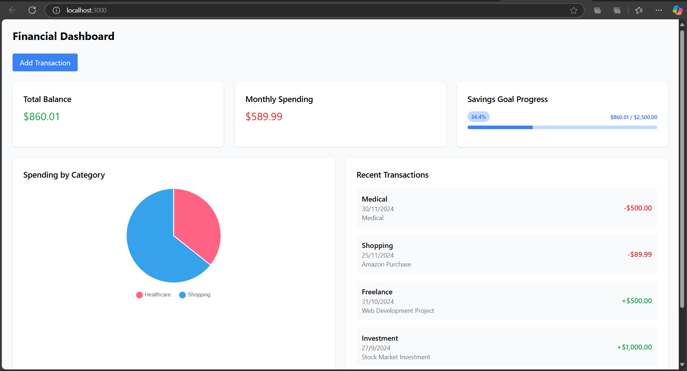

# Fintech Transaction Dashboard

A comprehensive full-stack financial management platform featuring real-time transaction tracking, analytics, and interactive visualizations.


## Features

- Real-time transaction management
- Interactive financial analytics
- Dynamic spending visualizations
- Secure transaction processing
- Responsive design
- Savings goal tracking

## Tech Stack

### Frontend
- React with TypeScript
- Chart.js for visualizations
- Tailwind CSS for styling
- Axios for API communication

### Backend
- Node.js with Express
- SQLite database
- Knex.js ORM
- Input validation middleware

## Getting Started

### Prerequisites
- Node.js >= 14.0.0
- npm >= 6.14.0

### Installation

1. Clone the repository
```bash
git clone https://github.com/ramcharantejpuli/fintech-transaction-dashboard.git
cd fintech-transaction-dashboard
```

2. Install dependencies
```bash
# Install server dependencies
cd server
npm install

# Install client dependencies
cd ../client
npm install
```

3. Setup database
```bash
cd ../server
npx knex migrate:latest
npx knex seed:run
```

4. Start the application
```bash
# Start server (from server directory)
npm start

# Start client (from client directory)
npm start
```

5. Access the application
- Frontend: http://localhost:3000
- Backend API: http://localhost:3001

## Screenshots

### Dashboard Overview

*Main dashboard showing real-time financial tracking and analytics*

### Transaction Management

*Transaction form with comprehensive input validation*

## Key Features

### Transaction Management
- Add income and expenses
- Process refunds
- Categorize transactions
- View transaction history

### Security Features
- Input validation
- Transaction idempotency
- Error handling
- Status tracking

## API Documentation

### Endpoints

#### GET /api/transactions
- Retrieves all transactions
- Supports pagination
- Orders by date descending

#### GET /api/transactions/by-category
- Returns spending by category
- Includes transaction counts

#### POST /api/transactions
- Creates new transactions
- Validates input data
- Returns transaction details

#### POST /api/transactions/refund/:id
- Processes transaction refunds
- Updates transaction status

## Contributing

1. Fork the repository
2. Create your feature branch (`git checkout -b feature/AmazingFeature`)
3. Commit your changes (`git commit -m 'Add some AmazingFeature'`)
4. Push to the branch (`git push origin feature/AmazingFeature`)
5. Open a Pull Request

## License

This project is licensed under the MIT License - see the [LICENSE](LICENSE) file for details.

## Author

**Puli Ram Charan Tej**
- Email: ramcharantejpuli@gmail.com
- GitHub: [@ramcharantejpuli](https://github.com/ramcharantejpuli)
- LinkedIn: [Puli Ram Charan Tej](https://www.linkedin.com/in/ramcharantejpuli)

## Project Link

[https://github.com/ramcharantejpuli/fintech-transaction-dashboard](https://github.com/ramcharantejpuli/fintech-transaction-dashboard)

Copyright 2024 Puli Ram Charan Tej. All rights reserved.
